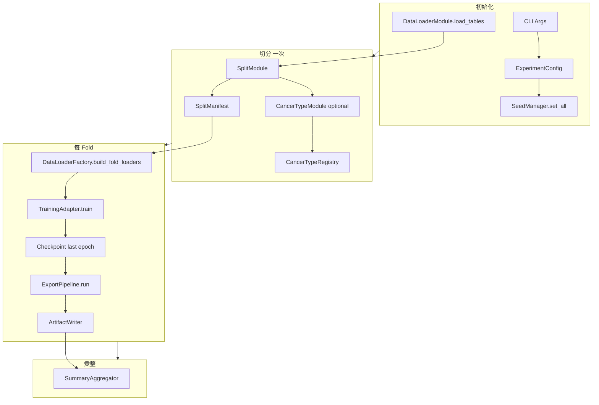
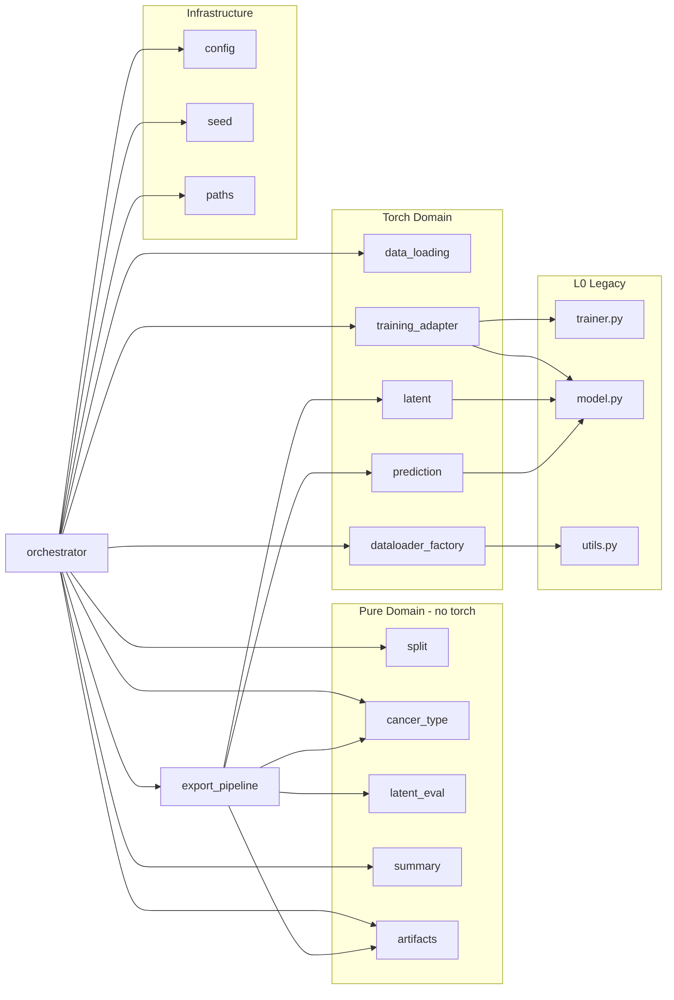
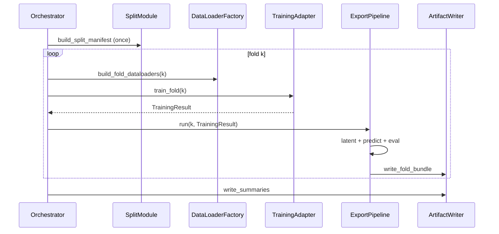

# SSDA4Drug Latent 改良版 — 系統架構設計

> **文件狀態**：v1.0（架構設計稿）  
> **需求來源**：[proposal.md](./proposal.md)  
> **設計目標**：在保留原版 SSDA4Drug 訓練核心（`trainer.py` / `model.py` / `utils.create_dataset`）的前提下，以**高內聚、低耦合**模組完成 5-fold、latent、prediction 與評估輸出，並支援獨立單元測試。

---

## 1. 架構總覽

### 1.1 設計原則

| 原則 | 說明 |
|---|---|
| **核心凍結** | `model.py` 不變；`trainer.py` 僅允許非侵入式擴充（見 §6.3） |
| **DataLoader 相容** | 訓練仍透過 `utils.create_dataset`；sample ID 在 pandas 層追蹤 |
| **副作用集中** | 檔案 I/O 統一由 `ArtifactWriter` 負責，業務模組回傳純資料結構 |
| **可測試** | 切分、對齊、metrics、繪圖模組**不依賴 GPU / 完整訓練** |
| **向後相容** | 原版 `save/results/sc/`、`save/sc/all_path/` 可選保留（見 AD-05） |

### 1.2 邏輯分層

```text
┌─────────────────────────────────────────────────────────────────┐
│  L4  Entry          experiment_shot.py (薄入口，向後相容)        │
├─────────────────────────────────────────────────────────────────┤
│  L3  Orchestration  ssda_latent.orchestrator.ExperimentRunner   │
├─────────────────────────────────────────────────────────────────┤
│  L2  Domain         split / cancer_type / train_adapter /       │
│                     export_pipeline / summary                     │
├─────────────────────────────────────────────────────────────────┤
│  L1  Infrastructure config / artifact_writer / seed / paths       │
├─────────────────────────────────────────────────────────────────┤
│  L0  Legacy Core    trainer.py, model.py, utils.py (既有)        │
└─────────────────────────────────────────────────────────────────┘
```

### 1.3 端到端資料流（單 seed、5-fold）



---

## 2. 目錄與套件結構

### 2.1 建議目錄配置

新增獨立套件目錄，避免根目錄檔案膨脹，並利於 `pytest` 以 package 方式測試：

```text
SSDA4Drug-main/
├── experiment_shot.py          # 薄入口：解析 args → 呼叫 ExperimentRunner
├── trainer.py                  # L0 凍結（loss 不變）
├── model.py                    # L0 凍結
├── utils.py                    # L0 凍結
├── ssda_latent/                # 新增套件（本設計核心）
│   ├── __init__.py
│   ├── config.py               # ExperimentConfig, 參數驗證
│   ├── seed.py                 # SeedManager
│   ├── paths.py                # RunLayout 路徑規劃
│   ├── data_loading.py         # 讀取 processed CSV
│   ├── split.py                # source test + 5-fold + target few-shot
│   ├── cancer_type.py          # metadata 對齊
│   ├── dataloader_factory.py   # 呼叫 utils.create_dataset 的 adapter
│   ├── training_adapter.py     # 建模、呼叫 train_semi_*
│   ├── latent.py               # encoder latent 抽取
│   ├── prediction.py           # 全樣本推論 + classification metrics
│   ├── latent_eval.py          # t-SNE, FID/MMD/Wasserstein, KMeans
│   ├── artifacts.py            # ArtifactWriter（統一寫檔）
│   ├── export_pipeline.py      # 串接 latent + pred + eval
│   ├── summary.py              # 5-fold 彙整
│   └── orchestrator.py         # ExperimentRunner 主流程
├── tests/                      # 單元測試（建議）
│   ├── test_split.py
│   ├── test_cancer_type.py
│   ├── test_latent_eval.py
│   └── test_prediction_metrics.py
└── docs/
    ├── proposal.md
    └── design.md
```

> **AD-01（待確認）**：是否接受 `ssda_latent/` 子套件，而非 proposal 中的根目錄 `*_utils.py`？  
> **本設計預設**：採用 `ssda_latent/`（理由：邊界清晰、可獨立測試、不污染既有 benchmark import 路徑）。

---

## 3. 模組劃分與職責

### 3.1 模組一覽

| 模組 | 檔案 | 職責 | 依賴 | 可單測 |
|---|---|---|---|:---:|
| **M1 Config** | `config.py` | CLI → `ExperimentConfig`；驗證 `n`, `n_splits`, paths | argparse, pathlib | ✓ |
| **M2 Seed** | `seed.py` | 統一設定 PyTorch / NumPy / Python / sklearn seed | torch, numpy, random | ✓ |
| **M3 Paths** | `paths.py` | `RunLayout`：seed 級、fold 級輸出路徑 | pathlib | ✓ |
| **M4 DataLoading** | `data_loading.py` | 讀 source/target expression + meta；轉 sample×gene | pandas | ✓ |
| **M5 Split** | `split.py` | source test、5-fold、target few-shot；產出 `SplitManifest` | pandas, sklearn | ✓ |
| **M6 CancerType** | `cancer_type.py` | 讀取、normalize、對齊；`CancerTypeRegistry` | pandas | ✓ |
| **M7 DataLoaderFactory** | `dataloader_factory.py` | 依 manifest 切片 DataFrame → `utils.create_dataset` | utils, torch | △ |
| **M8 TrainingAdapter** | `training_adapter.py` | 建 encoder/predictor；呼叫 `train_semi_dae/mlp`；存 checkpoint | trainer, model, utils | △ |
| **M9 Latent** | `latent.py` | `get_encoder_latent`；batch encode；`LatentDict` | torch, model | △ |
| **M10 Prediction** | `prediction.py` | 全樣本 logits/softmax；metrics 計算 | torch, sklearn | ✓ |
| **M11 LatentEval** | `latent_eval.py` | t-SNE 圖、FID/MMD/Wasserstein、KMeans metrics | numpy, sklearn, matplotlib | ✓ |
| **M12 Artifacts** | `artifacts.py` | 寫 pkl/csv/png/json；不承載業務邏輯 | pickle, pandas | ✓ |
| **M13 ExportPipeline** | `export_pipeline.py` | 編排 M9–M12；組 metadata 表 | M9–M12, M6 | △ |
| **M14 Summary** | `summary.py` | 跨 fold 彙整 metrics / latent metrics | pandas | ✓ |
| **M15 Orchestrator** | `orchestrator.py` | `ExperimentRunner.run()` 主迴圈 | M1–M14 | △ |
| **L0 Legacy** | `trainer/model/utils` | 原版訓練與模型 | — | 既有 |

### 3.2 模組依賴圖（允許方向）



**禁止的依賴（耦合反模式）**：

- `split` / `cancer_type` / `latent_eval` **不得** import `trainer` 或 `model`
- `trainer` **不得** import `ssda_latent`（單向依賴）
- `latent_eval` **不得** import `torch`（僅吃 numpy 矩陣或 dict）

---

## 4. 核心資料契約（Contracts）

模組間以 **不可變資料結構** 傳遞，避免共享可變 DataFrame 造成 fold 間污染。

### 4.1 `ExperimentConfig`（M1）

```python
@dataclass(frozen=True)
class ExperimentConfig:
    drug: str
    gene: str                    # e.g. "_tp4k"
    n_shot: int                  # args.n
    random_seed: int
    source_test_size: float
    n_splits: int
    encoder: str                 # "DAE" | "MLP"
    method: str
    epochs: int
    lr: float
    batch_size: int
    dropout: float
    encoder_h_dims: tuple[int, ...]
    predictor_h_dims: tuple[int, ...]
    device: str
    latent_output_dir: str
    # optional cancer type
    source_cancer_type_path: str | None
    target_cancer_type_path: str | None
    sample_id_col: str
    cancer_type_col: str
    # behavior flags (see AD-02 ~ AD-05)
    stratify_source: bool
    missing_cancer_type_policy: Literal["unknown", "exclude"]
    save_legacy_outputs: bool
    run_cancer_eval: bool
```

### 4.2 `ExpressionTables`（M4 輸出）

```python
@dataclass(frozen=True)
class ExpressionTables:
    x_source: pd.DataFrame       # index=sample_id, columns=gene
    y_source: pd.DataFrame       # columns: response, [logIC50]
    x_target: pd.DataFrame
    y_target: pd.DataFrame
```

### 4.3 `SplitManifest`（M5 輸出）

```python
@dataclass(frozen=True)
class SampleSplit:
    sample_id: str
    domain: Literal["source", "target"]
    response_label: int
    # exactly one of:
    source_split: str | None     # source_test | source_fold_train | source_fold_val
    target_role: str | None      # target_labeled_train | ... | target_test
    fold_index: int | None       # source fold train/val only

@dataclass(frozen=True)
class FoldIndices:
    fold_index: int
    train_ids: frozenset[str]
    val_ids: frozenset[str]

@dataclass(frozen=True)
class SplitManifest:
    source_test_ids: frozenset[str]
    folds: tuple[FoldIndices, ...]           # len = n_splits
    target_assignments: dict[str, str]       # sample_id -> target_role
    all_samples: tuple[SampleSplit, ...]     # 扁平化，供 export 標註
```

**切分順序（與 proposal 一致）**：

1. `source_full` → stratified `source_test` + `source_train_val`（若 AD-02 確認 stratify）
2. `source_train_val` → `StratifiedKFold` → `folds`
3. `target_full` → 80/20 train/val（`random_seed`）
4. train/val 各自 n-shot → labeled / unlabeled roles
5. `target_test` = all target − `target_labeled_train` ids

### 4.4 `CancerTypeRegistry`（M6 輸出）

```python
@dataclass(frozen=True)
class CancerTypeAlignmentReport:
    domain: str
    total_expression_samples: int
    matched_samples: int
    missing_in_metadata: int
    extra_in_metadata: int
    unknown_samples: int
    excluded_samples: int

@dataclass(frozen=True)
class CancerTypeRegistry:
    source_map: dict[str, str]   # sample_id -> cancer_type | "Unknown"
    target_map: dict[str, str]
    reports: tuple[CancerTypeAlignmentReport, ...]
    is_available: bool
```

### 4.5 `TrainingResult`（M8 輸出）

```python
@dataclass(frozen=True)
class TrainingResult:
    fold_index: int
    encoder: nn.Module           # eval mode, last epoch
    predictor: nn.Module
    adentropy_p: nn.Module
    checkpoint_path: str
    train_log_path: str | None   # legacy _train_AUCs_.txt
```

### 4.6 `ExportBundle`（M13 輸出，寫入前記憶體表示）

```python
@dataclass
class ExportBundle:
    source_latent: dict[str, list[float]]
    target_latent: dict[str, list[float]]
    source_predictions: pd.DataFrame
    target_predictions: pd.DataFrame
    source_val_metrics: dict[str, float]
    source_test_metrics: dict[str, float]
    target_metrics: dict[str, float]
    latent_distribution_metrics: dict[str, float]
    kmeans_metrics: dict[str, float] | None
    tsne_domain_png: bytes | None      # 或 Path，由 ArtifactWriter 決定
    tsne_cancer_png: bytes | None
```

---

## 5. 模組詳細設計

### 5.1 M5 `split.py` — 資料切分

**公開 API**：

```python
def build_split_manifest(
    tables: ExpressionTables,
    config: ExperimentConfig,
) -> SplitManifest: ...

def manifest_to_source_split_df(manifest: SplitManifest, fold_index: int) -> pd.DataFrame: ...
def manifest_to_target_split_df(manifest: SplitManifest) -> pd.DataFrame: ...
```

**設計要點**：

- 僅依賴 `pandas` + `sklearn.model_selection`
- `random.seed(config.random_seed)` 用於 target n-shot 抽樣
- 驗證：labeled 每 class 數量 = `n_shot`；集合互斥；test 不進 train

**單元測試**：固定小 DataFrame + seed → 快照比對 split CSV hash。

---

### 5.2 M6 `cancer_type.py` — Cancer type 對齊

**公開 API**：

```python
def load_cancer_type_table(path: str, sample_id_col: str, cancer_type_col: str,
                           normalizer: SampleIdNormalizer) -> pd.DataFrame: ...

def build_registry(
    tables: ExpressionTables,
    config: ExperimentConfig,
) -> CancerTypeRegistry: ...
```

**`SampleIdNormalizer` 策略介面**（策略模式，低耦合）：

```python
class SampleIdNormalizer(Protocol):
    def normalize(self, sample_id: str, domain: str) -> str: ...

class DefaultNormalizer: ...      # str.strip()
class TCGAPatientNormalizer: ...  # TCGA-XX-XXXX（可選，AD-06）
```

**缺失策略**（對應 proposal Q8）：

| policy | prediction/latent metadata | t-SNE / KMeans |
|---|---|---|
| `unknown` | 填 `Unknown` | 保留點 |
| `exclude` | 填 `Unknown` 或空 | 排除該 sample |

---

### 5.3 M7 `dataloader_factory.py` — DataLoader 適配器

**職責**：將 `SplitManifest` 的 index 子集轉為原版 `dataloader_source` / `dataloader_labeled_target` / `dataloader_unlabeled_target` 結構。

```python
@dataclass(frozen=True)
class FoldDataLoaders:
    source: dict[str, DataLoader]       # keys: train, val
    target_labeled: dict[str, DataLoader]
    target_unlabeled: dict[str, DataLoader]

def build_fold_dataloaders(
    tables: ExpressionTables,
    manifest: SplitManifest,
    fold_index: int,
    config: ExperimentConfig,
) -> FoldDataLoaders: ...
```

**與原版對齊**：

- source train：`WeightedRandomSampler`（從 `experiment_shot.py` 搬移，不修改 `utils.py`）
- batch_size / shuffle 與原版一致
- target labeled/unlabeled 的 train/val phase 各自對應原版兩個 DataLoader

---

### 5.4 M8 `training_adapter.py` — 訓練適配

**職責**：封裝 `experiment_shot.py` 中的模型建構與 `trainer.train_semi_*` 呼叫，**不改 loss**。

```python
def build_models(config: ExperimentConfig, device: torch.device) -> ModelBundle: ...

def train_fold(
    models: ModelBundle,
    loaders: FoldDataLoaders,
    config: ExperimentConfig,
    fold_index: int,
    legacy_auc_path: str | None,
) -> TrainingResult: ...
```

**Checkpoint 策略**（對應 proposal Q17–Q18）：

| 策略 | 行為 |
|---|---|
| **預設 `last_epoch`** | 與原版一致；`model_final.pth` = 最後 epoch state_dict |
| **可選 `best_val`**（AD-03） | 若啟用，需在 adapter 內複製 best 追蹤邏輯（不修改 trainer 內部） |

**建議實作 best_val（若採用）**：在 `training_adapter` 外包一層 epoch callback，或 fork `train_semi_*` 為 `train_semi_*_with_return_best`（僅在 AD-03 確認後）。

---

### 5.5 M9 `latent.py` — Latent 抽取

```python
def get_encoder_latent(encoder: nn.Module, x: Tensor) -> Tensor: ...

def encode_latent_dict(
    encoder: nn.Module,
    x_df: pd.DataFrame,
    device: torch.device,
    batch_size: int,
) -> dict[str, list[float]]: ...
```

**DAE 行為**（proposal Q19 / AD-04）：

- **預設**：`encoder(x)` → `[0]`（含 denoising，與 `Test_Double_Model` 一致）
- **可選模式**：`encoder.ae.encode(x)`（無 denoising），由 `config.latent_mode` 切換

**效能**：`torch.no_grad()` + `encoder.eval()`；按 batch 迭代 sample×gene DataFrame。

---

### 5.6 M10 `prediction.py` — 推論與 metrics

```python
def predict_dataframe(
    model: Test_Double_Model,
    x_df: pd.DataFrame,
    device: torch.device,
    batch_size: int,
) -> pd.DataFrame:
    """Columns: sample_id, pred_label, probability_class_0, probability_class_1, confidence"""

def compute_binary_metrics(y_true: np.ndarray, y_score: np.ndarray) -> dict[str, float]:
    """AUC, AUPR, accuracy, f1, balanced_accuracy — 复用 utils.roc_auc_score_trainval"""
```

**合併標註**：

```python
def build_prediction_table(
    pred_df: pd.DataFrame,
    manifest: SplitManifest,
    registry: CancerTypeRegistry | None,
    config: ExperimentConfig,
    fold_index: int,
    domain: Literal["source", "target"],
) -> pd.DataFrame: ...
```

**Metrics 範圍**（proposal Q5）：

- `source_val_metrics`：`source_fold_val` ids
- `source_test_metrics`：`source_test` ids
- `target_prediction_metrics`：預設 **all target**（可配置 AD-07）

---

### 5.7 M11 `latent_eval.py` — 分布與聚類評估

**純 numpy/sklearn**，輸入為 `LatentDict` 或 `np.ndarray` + labels。

```python
def compute_distribution_metrics(
    source_latent: np.ndarray,
    target_latent: np.ndarray,
) -> dict[str, float]:  # fid, mmd, wasserstein

def compute_kmeans_cancer_metrics(
    latent: np.ndarray,
    cancer_types: np.ndarray,
    k: int,
    random_state: int,
) -> dict[str, float]: ...

def plot_tsne_domain(...) -> matplotlib.figure.Figure: ...
def plot_tsne_cancer(...) -> matplotlib.figure.Figure: ...
```

**FID/MMD/Wasserstein 實作來源**（AD-08）：

| 方案 | 優點 | 缺點 |
|---|---|---|
| A. vendor 複製 DAPL `tools.latent_metrics` | 與 DAPL 數值一致 | 需維護副本 |
| B. `sys.path` 引用 DAPL-master | 無重複程式 | 路徑耦合、CI 需 DAPL |
| **C. 本 repo 自實作（預設）** | 零外部 repo 依賴 | 需與 DAPL 對齊驗證 |

**預設**：方案 C，並在 `tests/test_latent_eval.py` 以固定小矩陣做 regression snapshot。

---

### 5.8 M12 `artifacts.py` — 統一寫檔

```python
@dataclass(frozen=True)
class RunLayout:
    run_dir: Path              # .../latent_ssda/{drug}/seed_{seed}/
    fold_dir: Callable[[int], Path]

class ArtifactWriter:
    def write_config(self, config: ExperimentConfig, extra: dict) -> None: ...
    def write_split_tables(self, manifest: SplitManifest) -> None: ...
    def write_cancer_summary(self, registry: CancerTypeRegistry) -> None: ...
    def write_fold_bundle(self, fold_index: int, bundle: ExportBundle, models: TrainingResult) -> None: ...
    def write_summaries(self, summary_dfs: dict[str, pd.DataFrame]) -> None: ...
```

**效益**：路徑規則只在一處修改；Export 模組不直接 `open()` 檔案。

---

### 5.9 M13 `export_pipeline.py` — Fold 級匯出編排

```python
class ExportPipeline:
    def __init__(self, config: ExperimentConfig, registry: CancerTypeRegistry | None, writer: ArtifactWriter): ...

    def run(
        self,
        fold_index: int,
        training: TrainingResult,
        tables: ExpressionTables,
        manifest: SplitManifest,
    ) -> ExportBundle:
        # 1. encode all source / all target latent
        # 2. predict all source / all target
        # 3. metrics on val/test/target subsets
        # 4. latent_eval (domain tsne always; cancer tsne if registry.is_available)
        # 5. delegate to ArtifactWriter
```

---

### 5.10 M14 `summary.py` — 跨 fold 彙整

```python
def aggregate_fold_metrics(fold_dirs: list[Path]) -> pd.DataFrame: ...
def aggregate_latent_metrics(fold_dirs: list[Path]) -> pd.DataFrame: ...
def aggregate_kmeans_metrics(fold_dirs: list[Path]) -> pd.DataFrame: ...
```

輸出至 `seed_{seed}/metrics_summary.csv` 等（與 proposal §11 一致）。

---

### 5.11 M15 `orchestrator.py` — 主流程

```python
class ExperimentRunner:
    def __init__(self, config: ExperimentConfig): ...

    def run(self) -> None:
        SeedManager.set_all(self.config.random_seed)
        layout = RunLayout.from_config(self.config)
        writer = ArtifactWriter(layout)

        tables = DataLoadingModule.load(self.config)
        manifest = build_split_manifest(tables, self.config)
        registry = build_registry(tables, self.config)  # may be empty/skipped

        writer.write_config(...)
        writer.write_split_tables(manifest)
        if registry.is_available:
            writer.write_cancer_summary(registry)

        fold_results = []
        for fold in range(self.config.n_splits):
            loaders = build_fold_dataloaders(tables, manifest, fold, self.config)
            training = train_fold(..., fold_index=fold)
            bundle = ExportPipeline(...).run(fold, training, tables, manifest)
            fold_results.append(layout.fold_dir(fold))

        SummaryAggregator(writer).aggregate(fold_results)
```

---

## 6. 與既有程式碼的整合策略

### 6.1 `experiment_shot.py` 改造方式（AD-01 延伸）

**預設方案：薄入口保留檔名**

```python
# experiment_shot.py（改造後）
def main(args):
    config = build_experiment_config(args)
    ExperimentRunner(config).run()
```

- 移除 `for i in range(50)`
- 原版 CLI 參數保留；新增參數在 `config.py` 擴充
- **不向後提供 50-seed 模式**（除非 AD-09 要求）

### 6.2 `trainer.py` 變更邊界

| 允許 | 不允許 |
|---|---|
| 新增獨立函式 `predict_logits_batch`（若放在 trainer 會增加耦合，**建議放 M10**） | 修改 `loss_c` / `loss_ae` / `adentropy` 權重 |
| 從 `training_adapter` 傳入不同 DataLoader | 修改 `Test_Double_Model` |
| 可選：提取 `train_semi_*` 重複邏輯為內部 helper（非本階段必須） | 讓 trainer import `ssda_latent` |

### 6.3 `utils.create_dataset` 不變契約

```python
# 輸入：x: gene×sample DataFrame, y: meta with 'response'
# 輸出：DataLoader(TensorDataset(FloatTensor, LongTensor))
```

`dataloader_factory` 負責在呼叫前 `.loc` 子集並 `.T`。

---

## 7. 輸出物與路徑（對齊 proposal）

由 `RunLayout` 集中產生：

```python
def fold_dir(self, k: int) -> Path:
    return self.run_dir / f"fold_{k}"

def seed_dir(self) -> Path:
    return Path(self.config.latent_output_dir) / self.config.drug / f"seed_{self.config.random_seed}"
```

檔案清單見 proposal §11；`ArtifactWriter.write_fold_bundle` 維護 **檔名常數表** `ARTIFACT_NAMES` 以避免拼字錯誤。

---

## 8. 錯誤處理與日誌

| 情境 | 行為 |
|---|---|
| target 某 class 樣本數 < `n_shot` | 啟動前 `SplitModule.validate()` 拋出明確錯誤 |
| 未提供 cancer type | `registry.is_available=False`；跳過 cancer t-SNE / KMeans；寫 log |
| FID 樣本數過少 | 回傳 `nan` 並記錄 warning |
| CUDA 不可用且 `--device gpu` | 與原版相同 fallback CPU |
| 輸出目錄已存在 | **AD-10**：預設 `overwrite` 或 `fail`？建議 `overwrite` + 寫入新 config timestamp |

**日誌**：每 fold 寫 `fold_k/run.log`（標準 logging 模組），與 stdout 同步。

---

## 9. 測試策略

### 9.1 單元測試（無 GPU）

| 測試檔 | 對象 | 方法 |
|---|---|---|
| `test_split.py` | M5 | 合成 20 source + 10 target；斷言互斥與比例 |
| `test_cancer_type.py` | M6 | mock CSV；normalizer；missing policy |
| `test_latent_eval.py` | M11 | 固定矩陣；metrics 有限值 |
| `test_prediction_metrics.py` | M10 | 完美分類 / 隨機標籤 AUC 邊界 |
| `test_paths.py` | M3 | 路徑生成 |

### 9.2 整合測試（可選 GPU）

```bash
python experiment_shot.py --drug Gefitinib --n 3 --epochs 2 --random_seed 42 --n_splits 2
```

斷言：

- `fold_0/source_latent_representation.pkl` 樣本數 = source 全體
- latent 向量長度 128
- `source_prediction_results.csv` 行數 = source 樣本數

### 9.3 與原版一致性測試

固定 `random_seed=0`、`n_splits=1`（退化成單次 split）、相同 hyperparams：比對 **同一 epoch 數** 下 source val AUC 趨勢是否與舊版同數量級（允許浮點誤差，因 source split 改為 5-fold 後數值不必逐 bit 相同）。

---

## 10. 實作順序（對應模組）

| 階段 | 模組 | 交付物 |
|---|---|---|
| **P0** | M1, M2, M3, M4, M5, M15(骨架) | 可跑通 fold loop + split CSV |
| **P1** | M7, M8 | 訓練 + `model_final.pth` |
| **P2** | M9, M10, M12, M13 | latent pkl + prediction CSV + metrics |
| **P3** | M6, M11 | cancer 對齊 + t-SNE + FID/KMeans |
| **P4** | M14 | summary CSV + legacy 輸出（若啟用） |

---

## 11. 架構層級待確認項（AD）

以下為 **架構設計專用** 取捨，與 proposal §17 需求問題相互獨立。請回覆編號；未回覆前 **實作採「預設」欄**。

| ID | 問題 | 預設 | 影響 |
|---|---|---|---|
| **AD-01** | 新程式碼放在 `ssda_latent/` 套件，而非根目錄 `*_utils.py`？ | **是** | 目錄結構、測試配置 |
| **AD-02** | source test + 5-fold 是否 **stratify**？（proposal Q1–Q2） | **是** | `split.py` 實作 |
| **AD-03** | 除 `model_final.pth`（last epoch）外，是否另存 **best val** checkpoint？（Q18） | **否** | `training_adapter` 複雜度 |
| **AD-04** | DAE latent 用 `forward`（denoise）或 `ae.encode`？（Q19） | **forward** | `latent.py` |
| **AD-05** | 是否保留原版 `save/results/sc/` 與 `save/sc/all_path/`？（Q20） | **是** | `training_adapter` 雙寫路徑 |
| **AD-06** | `SampleIdNormalizer` 是否內建 TCGA patient key 規則？（Q12） | **可插拔，預設僅 strip** | `cancer_type.py` |
| **AD-07** | `target_prediction_metrics` 對 **all target** 或僅 **target_test**？（Q5） | **all target** | `export_pipeline` 切片 |
| **AD-08** | FID/MMD/Wasserstein：**自實作** vs 引用 DAPL？ | **自實作** | `latent_eval.py` |
| **AD-09** | 是否保留 **50-seed loop** 為可選模式（`--num_seeds 50`）？ | **否** | orchestrator |
| **AD-10** | 輸出目錄已存在：**overwrite** 或 **fail**？ | **overwrite** | `ArtifactWriter` |
| **AD-11** | 是否輸出 **CSV 版 latent**（sample × 128）？（Q21） | **否**（僅 pkl） | `artifacts.py` |
| **AD-12** | KMeans 是否排除 `Unknown`？（Q15） | **排除** | `latent_eval.py` |
| **AD-13** | 缺失 cancer type：**Unknown** 或 **exclude**？（Q8） | **Unknown** | `cancer_type.py` |

### 11.1 與 proposal §17 的對應

| proposal | 架構落地 |
|---|---|
| Q1–Q2 | AD-02 → `SplitModule` |
| Q3 | `SplitManifest` 在 orchestrator **fold 迴圈外** 建立一次 |
| Q4 | `SplitModule` 複製原版 target 邏輯函式 `assign_target_roles()` |
| Q5 | AD-07 → `ExportPipeline._target_metrics_ids()` |
| Q6–Q7 | `prediction.py` 欄位 schema |
| Q8–Q12 | M6 + `SampleIdNormalizer` |
| Q13–Q15 | M11 `plot_tsne_*` / `compute_kmeans_*` |
| Q16 | M11 輸入為 full source/target latent matrices |
| Q17–Q19 | M8 / M9 |
| Q20–Q23 | AD-05 / orchestrator 條件分支 |

---

## 12. 介面序列圖（單 Fold）



---

## 13. 風險與緩解

| 風險 | 緩解 |
|---|---|
| `trainer` 回傳 last epoch 而非 best | 文件與 proposal 一致；latent/pred 皆用同一 checkpoint |
| DAE denoising 導致 latent 非 deterministic | 固定 seed；文件註明；可選 `latent_mode=encode` |
| target test leakage（原版行為） | `SplitManifest` 明確標註 role；metrics 預設 all target |
| fold 間 GPU OOM | 每 fold 結束 `del model; torch.cuda.empty_cache()` |
| DAPL metrics 數值不一致 | AD-08 選定後做對照實驗記錄於 tests |

---

## 14. 文件修訂紀錄

| 版本 | 日期 | 說明 |
|---|---|---|
| v1.0 | 2026-05-21 | 初版：模組劃分、契約、依賴、測試、AD 清單 |

---

*本設計假設 proposal.md 中的功能需求為準；需求確認後請同步更新 §11 AD 與 §4 契約中的預設值。*
